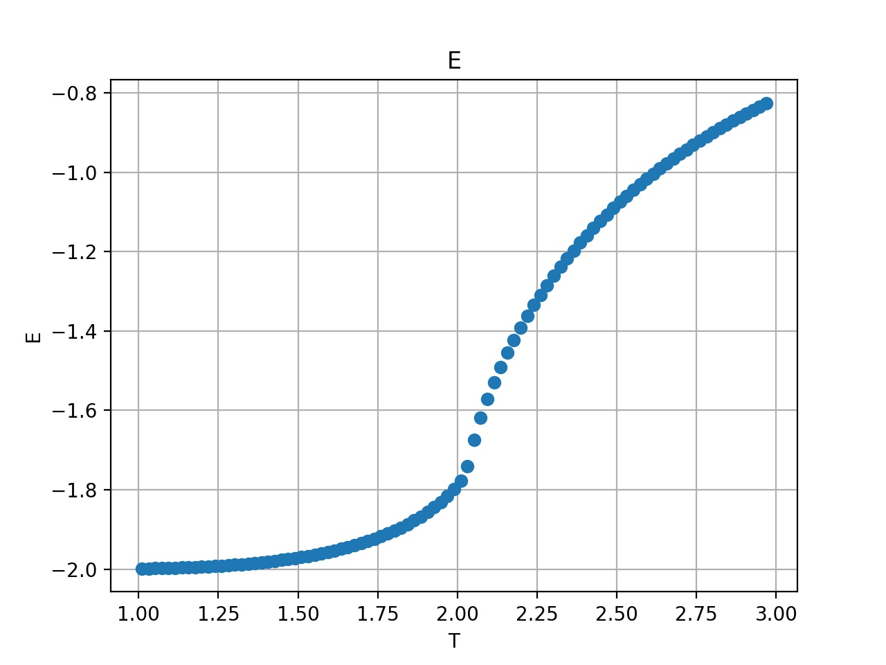
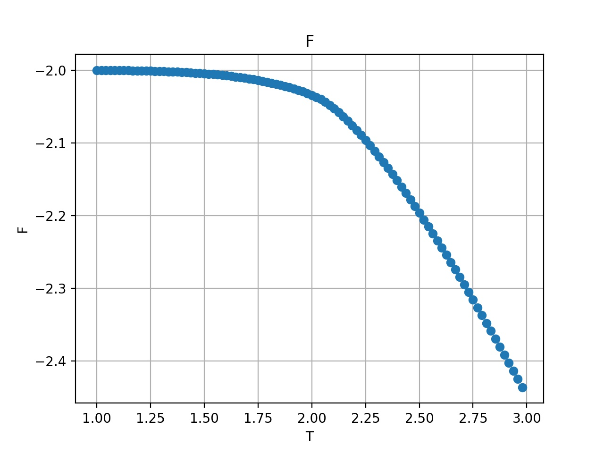
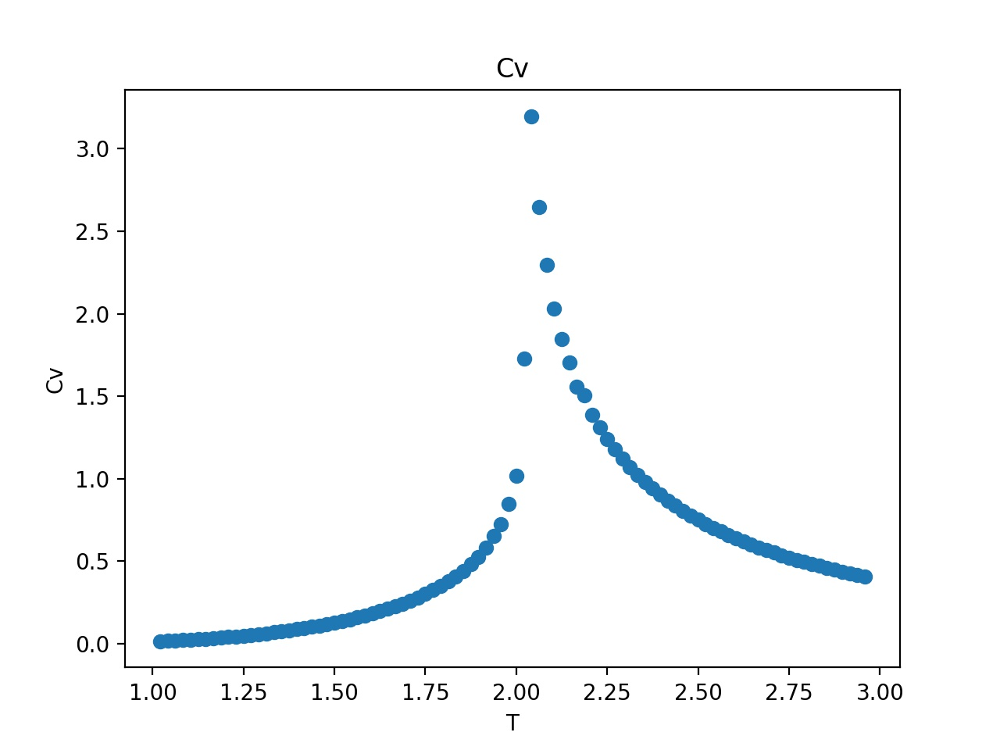

# HOTRG for 2D Ising J1-J2 model #

	[Note] This version is using the pre-alpha version of uni10. 

## Install Tuni10 ##

	see Tuni10_install/INSTALL_GUIDE.md for further details.

## To run ##

	$make
	$./j1j2_hotrg simparam.rc Tls

## Python version ##
    
    *the python version is implemented with pytorch

    see python_ver

## Result ##

Following shows the result for Chi = 6, L = 4096

Energy (per-site):

Free-Energy (per-site):

Specific heat (per-site):

